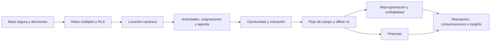

# Evolución de producto posterior a la reunión del 04-08-2026

Estado: propuesta para validación de producto y arquitectura  
Método: Spec-Driven Development (SDD)  
Fuente: minuta de la reunión del 04-08-2026 y auditoría del código en `main` al 05-08-2026  
Alcance: planificación; este paquete no modifica código, datos ni infraestructura

## Conclusión ejecutiva

La evolución es viable sin reemplazar el stack actual. Next.js, Supabase/Postgres/RLS y Dexie siguen siendo una base adecuada. Sin embargo, la mayoría de los pedidos no son cambios aislados de interfaz: comparten un nuevo núcleo de dominio.

El camino crítico recomendado es:

Empezar por offline, finanzas o reputación antes de estabilizar roles, locaciones, actividades y asignaciones produciría retrabajo y métricas poco confiables. La estrategia propuesta es incremental: migraciones aditivas, compatibilidad temporal, backfill medido, feature flags y retiro de lo anterior sólo después del cutover.

## Paquete SDD

- [Auditoría del estado actual](./current-state.md): evidencia del repositorio, reutilización y brechas por frente.
- [Requisitos](./requirements.md): alcance, reglas y criterios de aceptación trazables.
- [Diseño](./design.md): arquitectura objetivo, modelo propuesto, seguridad, migración y pruebas.
- [Plan de implementación](./tasks.md): releases ordenadas, tareas, dependencias y gates.

Estos documentos reemplazan como plan vigente cualquier inferencia que pudiera hacerse desde `BLUEPRINT.md`, `BLUEPRINT-EXPANSION.md` o `PLAN-MEJORAS.md`. Esos archivos siguen siendo historia útil de decisiones y entregas anteriores, no la especificación de este lote.

## Estado real frente a la minuta

| # | Frente | Estado actual | Evaluación | Release |
|---|---|---|---|---|
| 1 | Offline y sincronización | SW, Dexie, outbox, fotos y sincronización básica | Parcial; necesita rediseño del contrato y seguridad local | R5 |
| 2 | Finanzas empresa/instalador | Ingresos contractuales y por OT para empresa | Parcial; no hay costos, pagos, gastos ni vista privada del instalador | R7 |
| 3 | Multimedia y búsqueda por OT | Chat, adjuntos y búsqueda local en hasta 300 mensajes | Parcial; el hilo no está ligado a una OT | R8 |
| 4 | Locación canónica | Locaciones copiadas por proyecto; galería intenta reconstruir historial | Corrección estructural y fundacional | R2 |
| 5 | Oportunidad → cotización → proyecto | Bolsa vinculada a un proyecto existente; postulaciones sin precio | Nuevo flujo mayor | R4 |
| 6 | Cancelaciones, reprogramación y confiabilidad | Fechas, aceptación y contador de reprogramaciones | Nuevo dominio auditable | R6 |
| 7 | Relevamiento versus trabajo | `relevamiento` es un estado de la misma OT | Parcial; requiere separar tipo de actividad de estado | R3 |
| 8 | Importar/exportar locaciones | Importación XLSX/CSV y plantilla | Parcial; faltan preview, dedupe, exportación y atomicidad | R2 |
| 9 | Coordinador e instalador simultáneos | Un único rol excluyente por empresa | Cambio fundacional incompatible con el modelo actual | R1 |
| 10 | Reputación e historial | Estrellas, reseñas y conteo | Parcial; faltan reputación profesional y confiabilidad separadas | R8 |
| 11 | Agenda y conflictos | Fechas sin hora, disponibilidad por empresa y agenda de 15 días | Cambio mayor; no evita asignaciones superpuestas | R3 |
| 12 | Dashboard y clima | KPIs, mapa, clima y alertas ya existen | Mayormente ajuste; corregir fuentes y reorganizar después | R9 |
| 13 | Notificaciones y mensajes masivos | Leído, realtime, push y anuncios por zona/proyecto | Parcial; faltan archivo, prioridad visible y segmentación rica | R6/R8 |
| 14 | Progreso en campo | Aceptar, iniciar, avanzar, bloquear, revisar, aprobar/reabrir | Parcial; faltan eventos, evidencia mínima, checklist y trazabilidad completa | R5 |
| 15 | Cliente final sin acceso | No existe rol ni portal de cliente | Ya cumple; se formaliza como restricción | Todas |
| 16 | Email, pt-BR, manual y video | Flujos base e i18n técnico; configuración y QA pendientes | Gate operativo | R0/R9 |

## Hallazgos que entran antes de las mejoras

La auditoría encontró riesgos actuales que deben resolverse en R0 porque afectan la seguridad o la capacidad de entregar con confianza:

- La suspensión de una empresa cambia un estado, pero no bloquea efectivamente la sesión ni el acceso tenant.
- El conteo de usuarios del panel master se basa en `profiles.company_id` y omite membresías multiempresa.
- El Service Worker cachea páginas autenticadas y la limpieza ante cambio de cuenta no cubre todos los casos; existe riesgo de datos cruzados en un dispositivo compartido.
- La cola offline cambia el estado de una OT directamente y no conserva siempre el mismo historial que el comando online.
- `CachedTask` existe en Dexie, pero no se usa; una OT no queda realmente disponible offline de forma estructurada.
- No hay pipeline CI, suite E2E automatizada ni ejecución integrada de pgTAP/RLS.
- Node y pnpm no están fijados de forma reproducible; la instalación local reportó que los overrides declarados no se aplican con la versión actual.
- El checklist manual contiene 148 casos todavía sin evidencia marcada y falta observabilidad de errores, colas y jobs.

## Orden de releases

| Release | Objetivo | Frentes | Tamaño relativo | Resultado habilitante |
|---|---|---|---|---|
| R0 | Base segura y especificaciones cerradas | deuda actual, parte de 16 | L | CI/staging/telemetría, riesgos urgentes corregidos y ADRs aprobados |
| R1 | Membresía con roles múltiples | 9 | L | Una persona puede instalar y coordinar sin ampliar permisos por accidente |
| R2 | Locación canónica e intercambio de datos | 4, 8 | XL | Historial físico único e import/export determinista |
| R3 | Modelo operativo y agenda | 7, 11, base de 13 | XL | Actividades, horarios, asignación transaccional y conflictos privados |
| R4 | Oportunidad comercial | 5, 15 | XL | Cotización aprobada convierte de forma atómica a proyecto/OT |
| R5 | Campo y offline v2 | 1, 14 | XL | Mismo contrato online/offline, evidencia y eventos íntegros |
| R6 | Reprogramación, cancelación y entrega de avisos | 6, parte de 13 | XL | Compromisos reconfirmables y confiabilidad auditable en modo sombra |
| R7 | Finanzas | 2 | XL | Ingreso, costo, gasto, devengado y pagado dejan de confundirse |
| R8 | Colaboración y reputación | 3, 10, resto de 13 | XL | Chat por OT, archivo/segmentación y scores explicables |
| R9 | Insights y preparación operativa | 12, resto de 16 | L | Dashboard reconciliado, clima 48 h, pt-BR y documentación final |

Los tamaños son relativos y no equivalen a calendario. La estimación temporal requiere cerrar las decisiones de dominio, definir capacidad del equipo y medir el primer slice de cada release.

## Método de ejecución SDD

Cada slice vertical debe recorrer el mismo circuito:

1. Seleccionar requisitos `REQ-*` y ejemplos Given/When/Then.
2. Cerrar decisiones abiertas mediante ADR; no codificar reglas ambiguas.
3. Diseñar contrato, estados, permisos, migración, telemetría y rollback.
4. Escribir primero las pruebas de dominio, contrato y RLS que demuestran el comportamiento.
5. Implementar migración aditiva, servidor/RPC, UI e integración offline cuando corresponda.
6. Validar unitarias, integración, pgTAP, E2E, i18n, accesibilidad y escenarios adversos.
7. Activar por feature flag en staging; ejecutar UAT con evidencia.
8. Hacer rollout gradual, observar métricas y sólo después retirar el camino anterior.

Una tarea no se considera terminada porque “la pantalla funciona”. Debe demostrar aislamiento tenant, consistencia de datos, reintento seguro, trazabilidad, manejo de errores y rollback.

## Decisiones de producto que deben cerrarse

Se propone este baseline para poder avanzar; cada punto debe quedar confirmado en un ADR antes de su release:

| ID | Decisión | Baseline recomendado |
|---|---|---|
| DEC-01 | Bolsa existente versus oportunidad preproyecto | Mantener ambos conceptos separados: staffing de proyecto y oportunidad comercial |
| DEC-02 | Prueba de aprobación del cliente sin portal | La registra un manager/coordinador autorizado con fecha, autor, versión de cotización y adjunto/nota |
| DEC-03 | Autoaprobación de persona dual | Prohibir que quien ejecuta apruebe su propio relevamiento o finalización |
| DEC-04 | Acceso financiero del coordinador | Sin acceso por defecto; permiso explícito futuro si el negocio lo exige |
| DEC-05 | Devengamiento del honorario | Al aprobar la ejecución, no al marcarla enviada ni al pagarla |
| DEC-06 | Pagos e impuestos del MVP | Pagos parciales y ajustes/reversas; impuestos/retenciones como dato explícito, no motor fiscal |
| DEC-07 | Ventana de dos días hábiles | Reprogramación: desde notificación persistida. Baja común: la minuta no define el ancla; baseline, pedirla con al menos 2 días hábiles antes del inicio |
| DEC-08 | Penalizaciones | Modo sombra, explicación y revisión humana antes de afectar score visible |
| DEC-09 | Conflictos de agenda | Solapamiento y ausencia bloquean; traslado insuficiente bloquea con override auditado de manager |
| DEC-10 | Evidencia mínima | Configurable por tipo de actividad; valor inicial propuesto: 3 fotos en ejecución |
| DEC-11 | Búsqueda en imágenes | Caption/tags y metadatos en MVP; OCR/IA como decisión y experimento posterior |
| DEC-12 | Cliente final | Sigue sin cuenta, rutas ni acceso a archivos; un portal futuro será otro proyecto |
| DEC-13 | Fecha legacy sin hora | Migrar como “precisión desconocida”; no inventar horarios durante el backfill |
| DEC-14 | Verificación de email | Definir si la activación exige confirmación; hoy ciertos flujos marcan email confirmado |

## Non-goals de este lote

- Portal o autenticación para el cliente final.
- Motor contable/fiscal completo o conversión automática entre monedas.
- Interpretación automática de PDF/Word mezclada con el importador determinista.
- OCR/visión semántica de imágenes sin un experimento de precisión, costo y privacidad.
- Reprogramación o penalización automática basada únicamente en clima.
- Reemplazo de Next.js, Supabase, Postgres/RLS, Dexie o Vercel.

## Definición global de terminado

El lote queda terminado cuando:

- Todos los `REQ-*` de alcance están aceptados y trazados a tareas y pruebas.
- Las decisiones del release tienen ADR aprobado.
- Cada tabla, vista, RPC y bucket nuevo tiene matriz actor × acción, RLS y pruebas negativas entre dos empresas.
- Las migraciones tienen backfill medido, compatibilidad de despliegue y rollback ensayado.
- CI reproduce lint, type-check, unitarias, integración, pgTAP, E2E y build.
- Los flujos críticos pasan en staging con manager, coordinador, instalador, usuario dual y dos empresas.
- Offline pasa en teléfono real: modo avión, reinicio, reconexión, token vencido, carga interrumpida y cambio de cuenta.
- Métricas, colas, jobs y errores tienen observabilidad y runbook.
- Es/pt-BR, accesibilidad y 375 px/escritorio tienen evidencia de QA.
- El rollout se hizo con feature flag/canary y no quedan caminos legacy activos sin fecha de retiro.
