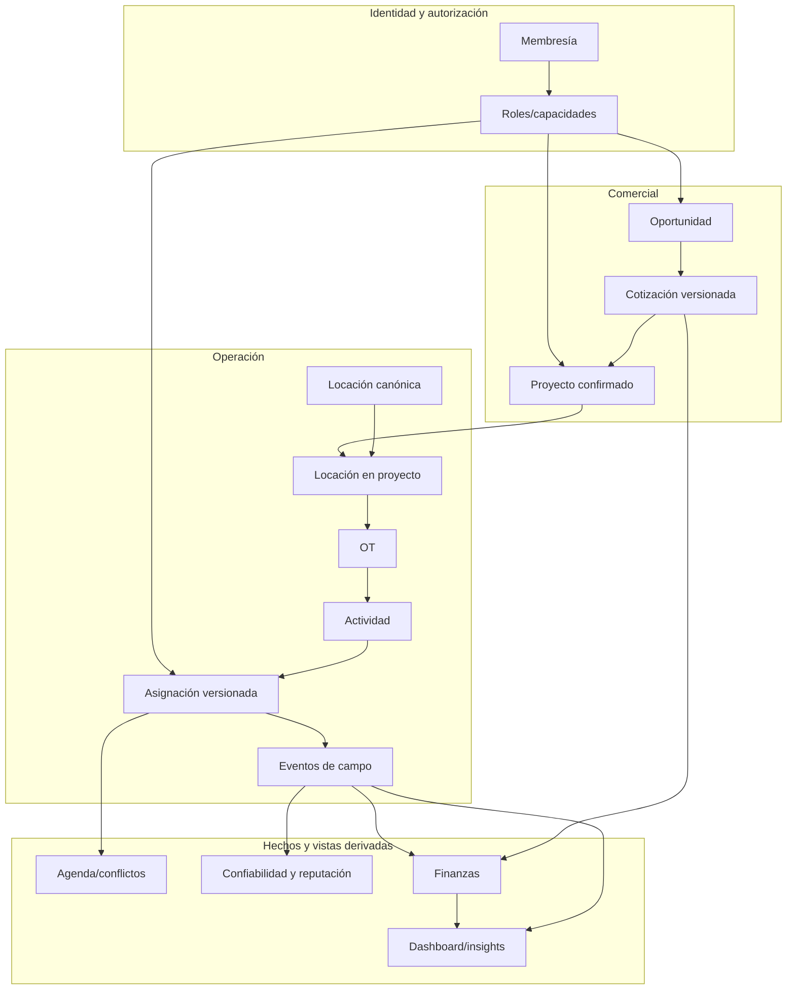

# Diseño técnico propuesto

Estado: baseline de arquitectura sujeto a los ADR indicados  
Stack: se conserva Next.js 16, React 19, TypeScript strict, Supabase/Postgres/RLS, Storage, Realtime, Dexie, next-intl, Vitest, pnpm y Vercel

## Principios de diseño

1. **Evolución aditiva:** crear estructuras nuevas, backfill, dual-read/dual-write, cutover y limpieza posterior. Ningún cambio destructivo en el primer deploy.
2. **Una única regla por comando:** UI online y outbox offline invocan el mismo contrato server-side; ningún cliente escribe estados críticos directamente.
3. **Eventos para hechos; proyecciones para lectura:** campo, confiabilidad y finanzas conservan historia inmutable y materializan resúmenes recalculables.
4. **Tenant y capacidad explícitos:** pertenecer a una empresa no equivale a poder operar todos sus recursos.
5. **Privacidad por diseño:** la disponibilidad cross-company responde lo mínimo y no filtra detalles; los datos financieros y sensibles tienen políticas específicas.
6. **Separación de conceptos:** tipo de trabajo no es estado; finalizado no es pagado; reputación no es confiabilidad; oportunidad no es staffing de proyecto.
7. **Despliegue reversible:** cada slice define compatibilidad, flag, métricas, rollback y fecha de retiro del camino anterior.

## Restricciones y deuda observada

| Área actual | Evidencia de implementación | Consecuencia |
|---|---|---|
| Rol por empresa | `company_installers.role` es escalar y la migración declara roles excluyentes | No permite usuario dual sin cambiar helpers, RLS, navegación y acciones |
| Locaciones | `sites.project_id` es obligatorio; reutilizar crea copias y duplica adjuntos | No hay identidad física ni historia confiable |
| Relevamiento | Es un estado de `work_orders` y un `order_update` | No representa trabajo independiente, aprobación o versiones |
| Agenda | `scheduled_date`/`scheduled_end_date` son `date` | No permite solapamiento horario ni traslado |
| Bolsa | La app exige `projectId`; postulación no tiene cotización | No existe oportunidad preproyecto ni conversión |
| Campo offline | Dexie/outbox existe, pero transición escribe `work_orders.status` | El contrato online y offline puede divergir |
| Chat | Hilo único por empresa + instalador | Mezcla conversaciones de distintas OTs |
| Finanzas | Deriva contratado/completado desde proyecto/OT | Confunde ingreso operativo con costo/pago |
| Notificaciones | `read_at` y anuncios básicos | No hay archivo, entrega auditada ni segmentos ricos |
| Calidad operativa | Tests locales documentados, sin CI/E2E integrado | No hay evidencia reproducible para cambios de alto riesgo |

## Arquitectura de dominio objetivo



Los nombres de tablas siguientes son propuestas lógicas. El ADR de cada release debe confirmar naming, columnas y estrategia de compatibilidad antes de escribir la migración.

## D1 — Membresías, roles y autorización

### Modelo

- `company_memberships`: identidad de la relación persona–empresa, estado, alta/baja y metadatos comunes.
- `company_membership_roles`: una fila por membresía y rol (`installer`, `coordinator`), con `granted_by`, `granted_at`, `revoked_at` o estado equivalente.
- La entidad profesional `installers` se conserva para quien tenga capacidad de instalación.
- Una vista/adaptador temporal mantiene consumidores de `company_installers` durante el cutover.

No se recomienda agregar un enum combinado como `installer_coordinator`: crece exponencialmente con futuras capacidades y vuelve ambiguas las policies.

### Autorización

- Reescribir helpers como `auth_companies`, `auth_has_company_role` y `can_operate_project` para resolver roles normalizados.
- El contexto activo de empresa determina navegación y operaciones; una sesión puede tener distintas capacidades por empresa.
- Coordinación se acota por asignación a proyecto/oportunidad, no sólo por membresía.
- Las aprobaciones comparan `actor_user_id` contra el ejecutor para bloquear autoaprobación.

### Cutover

1. Crear nuevas tablas/policies y backfill desde el rol escalar.
2. Habilitar dual-read y comparar resultados con telemetría.
3. Migrar acciones de invitación, promoción, asignación y navegación a capacidades.
4. Migrar todas las RLS y ejecutar matriz A/B/dual.
5. Dejar la columna legacy sólo como proyección temporal; retirarla en otro release.

## D2 — Locación canónica

### Modelo

- `locations`: `company_id`, `client_id`, referencia externa, nombre, dirección, geografía/coordenadas, contactos, acceso, riesgos, horarios y notas permanentes.
- `project_locations`: asociación proyecto–locación con alcance, cantidad/unidades, estado, datos contractuales y snapshots operativos cuando corresponda.
- `location_requirements`: permisos/requisitos con tipo, estado, vigencia, vencimiento y responsable.
- `location_attachments`: archivos permanentes; evidencias de OT siguen ligadas a su evento/actividad y se agregan en la ficha por consulta.
- `location_change_events`: auditoría de cambios canónicos y propuestas de coordinador/instalador.

### Identidad y dedupe

Clave primaria de negocio recomendada para import: `company_id + client_id + normalized_external_ref`, cuando existe. Dirección normalizada sirve para sugerir coincidencias, no para fusionar automáticamente. El backfill genera tres conjuntos: match seguro, nuevo y ambiguo para revisión.

### Compatibilidad

Agregar primero `sites.location_id`; mantener `sites` como asociación/proyección mientras se migran `work_orders`, adjuntos, RLS y rutas. No borrar `project_id` hasta que ninguna consulta dependa de él y se haya ensayado restauración.

## D3 — OT, actividades, relevamiento y asignaciones

### Modelo

- `work_orders`: contenedor con proyecto, locación asociada, referencia, alcance comercial y estado agregado.
- `work_activities`: unidad `survey` o `execution`, orden dentro de la OT, lifecycle, checklist/template, `scheduled_start_at`, `scheduled_end_at`, zona horaria y `schedule_precision`.
- `survey_submissions`: versiones de informe con datos estructurados, estado `draft/submitted/changes_requested/approved`, autor, aprobador y timestamps.
- `work_assignments`: compromiso versionado entre actividad e instalador; conserva términos, aceptación, vigencia, reemplazo y snapshot de honorario.
- `field_events`: append-only con `client_event_id`, versión esperada, actor, rol/contexto, `occurred_at`, `received_at`, tipo, payload validado y estado previo/nuevo.
- `field_event_attachments` y `checklist_responses`: evidencia normalizada y referenciable.

El estado agregado de la OT se calcula o actualiza dentro del mismo comando transaccional. `order_updates` puede seguir como proyección durante la migración para no romper pantallas.

### Máquina de estados

La actividad de ejecución contempla, como hechos, `accepted`, `en_route`, `arrived`, `progress`, `blocked`, `completion_requested`, `evidence_requested`, `changes_requested`, `approved` y `reopened`. No todos tienen que ser estados mutuamente excluyentes: `progress` y evidencias son eventos; el lifecycle conserva pocos estados estables.

El comando crítico recomendado es una RPC/función transaccional `submit_field_command` que:

1. autentica actor, empresa y asignación;
2. resuelve idempotencia por `client_event_id`;
3. bloquea el agregado y valida `expected_version`;
4. valida transición, checklist y evidencia;
5. inserta evento y actualiza proyección/versión;
6. crea notificación/outbox dependiente;
7. retorna versión y resultado canónico.

## D4 — Agenda y disponibilidad privada

### Modelo y motor

- Horario real en actividad/asignación mediante `timestamptz`, zona horaria IANA y rango temporal.
- Disponibilidad personal global, ausencias y bloqueos privados; preferencias por empresa separadas.
- Índices/rangos para detectar solapamiento y un lock transaccional por instalador.
- RPC `check_and_assign`/`reschedule_assignment` con `SECURITY DEFINER`, `search_path` fijo y respuesta mínima.

Respuesta externa sugerida:

```text
available: boolean
reason_code: available | overlap | unavailable | travel_time | stale_version
override_allowed: boolean
```

Nunca retorna empresa, cliente, dirección, OT ni horario causante del conflicto. Toda vía de creación, edición, reasignación, aceptación de oportunidad y reprogramación usa el mismo motor.

### Traslados

Fase 1: coordenadas canónicas + Haversine/velocidad y buffer conservador configurables. Fase 2: spike de proveedor vial y fallback. Los conflictos exactos/ausencias son hard block; un margen de traslado puede admitir override de manager con motivo y auditoría.

Los registros legacy de día completo llevan `schedule_precision = unknown/day`; no participan de reglas finas ni penalizaciones hasta ser reconfirmados.

## D5 — Oportunidades y cotizaciones

### Separación de dominios

- `broadcasts` sigue representando búsqueda de personal para un proyecto confirmado.
- `opportunities`, `opportunity_locations`, `opportunity_events` y `opportunity_attachments` representan el flujo preproyecto.
- `opportunity_quotes` y `opportunity_quote_revisions` conservan propuestas/versiones por instalador.
- `external_approvals` registra que un usuario interno recibió la confirmación del cliente, asociada a una versión exacta y a evidencia/nota.

### Conversión

Una RPC `convert_opportunity_to_project(command_id, opportunity_id, quote_revision_id, coordinator_id, ...)` debe:

- bloquear la oportunidad;
- validar estado, cotización, aprobación externa, coordinador y agenda;
- crear proyecto y asociaciones de locación;
- crear OT/actividades/asignación según plantilla aprobada;
- crear snapshot de compensación;
- marcar `converted_project_id` y evento de conversión;
- retornar el proyecto existente si se repite `command_id`.

La cotización de cada instalador es privada. La decisión sobre cotización sellada, múltiples ganadores o negociación visible debe cerrarse en ADR-005.

## D6 — Offline v2 y medios

### Almacenamiento local

Dexie conserva stores versionados y particionados por `user_id + company_id`:

- `cached_orders`, `cached_activities`, `cached_assignments`, `cached_location_summary`;
- `outbox_commands` con estado, dependencia, versión esperada, intentos y error estructurado;
- `pending_media` con hash, tamaño, MIME, política de red y progreso;
- `sync_receipts` para resultados confirmados y dedupe local.

Se cachean sólo los campos necesarios para ejecutar. La política debe definir TTL, límite, purga y riesgo de dispositivo perdido. No se afirmará “cifrado seguro” sin threat model: el baseline verificable es minimización, aislamiento por cuenta, bloqueo de acceso tras logout/revocación y limpieza de Cache Storage/IndexedDB. Cifrado adicional requiere un spike que resuelva gestión de claves y reapertura offline.

### Sincronización

- FIFO por agregado con dependencias explícitas; paralelismo sólo entre agregados independientes.
- El mismo command endpoint/RPC que usa online.
- Respuesta canónica con `synced/conflict/rejected/retryable` y error localizado.
- Backoff acotado; errores permanentes no se reintentan eternamente.
- El usuario puede inspeccionar y resolver, pero “descartar” requiere advertir qué dato no llegó y no puede borrar evidencia ya aceptada.

### Fotos

Pipeline: validación → orientación/redimensión/compresión local → hash → sesión resumible → confirmación server-side → referencia en comando. Debe investigarse la modalidad resumible compatible con Supabase Storage antes de fijar implementación. La transición final sólo se confirma cuando el servidor valida las referencias requeridas.

El Service Worker debe cachear un app shell público/versionado y respuestas estructuradas autorizadas, no páginas RSC autenticadas reutilizables entre cuentas.

## D7 — Reprogramación, cancelación y confiabilidad

### Modelo

- `schedule_revisions`: agenda anterior/nueva, motivo, actor, deadline y estado.
- `assignment_responses`: aceptar/rechazar/no-respuesta con timestamp y evidencia de notificación.
- `cancellation_requests`: categoría, texto minimizado, evidencia, revisor y resolución.
- `reliability_events`: hechos inmutables positivos/negativos/reversas con versión de regla.
- `reliability_rule_versions` y `installer_reliability_summary`: fórmula versionada y proyección.

Una reprogramación es un comando atómico: crea revisión, marca respuesta pendiente, persiste notificación in-app y agenda deadline. Email/push son deliveries secundarias. El scheduler emite recordatorios y vencimiento de forma idempotente.

Las reglas corren primero en **shadow mode**: se calculan y comparan, pero no afectan perfil/bolsa. Activación exige datos suficientes, revisión de sesgos, explicación visible y apelación funcional.

## D8 — Finanzas

### Modelo

Separar contratos y hechos:

- `work_order_pricing`: snapshot facturable al cliente y versión/origen.
- `work_order_compensations`: honorario acordado por asignación/cotización, moneda, condiciones y estado contractual.
- `compensation_events`: devengado, pago parcial, ajuste, disputa, reversa y cancelación.
- `project_financial_entries`: ingreso/factura/cobro/gasto/ajuste/reversa para P&L y presupuesto versus real.

Todos los importes usan `numeric` con escala acordada y moneda ISO por fila. No sumar monedas distintas. “Aprobada” puede devengar el honorario; “pagado” sólo surge de eventos de pago. Los movimientos no se editan: se corrigen con ajuste/reversa.

### Vistas y permisos

- Vista/RPC del instalador: únicamente sus compensaciones a través de todas sus empresas.
- Vista/RPC de empresa: únicamente el ledger de su `company_id`, con proyecto/OT/instalador.
- Coordinador: sin acceso por defecto.
- Administrador de plataforma: no obtiene detalle financiero tenant salvo un caso de soporte explícito, auditado y futuro.

## D9 — Chat, archivos y notificaciones

### Chat

- Evolucionar `chat_threads` con `scope_type`/`scope_id` o crear hilos de OT separados; mantener canal general si sigue siendo útil.
- Normalizar `chat_attachments` con tipo, MIME, tamaño, nombre, caption/tags, Storage path y metadatos de análisis.
- Búsqueda server-side paginada con índice full-text/trigram sobre cuerpo, enlaces, captions y nombre de archivo.
- RLS deriva acceso de la OT/proyecto/asignación; Storage replica la misma regla.

OCR/IA queda detrás de experimento. Caption/tags manuales y metadatos cubren el MVP de búsqueda de imágenes.

### Notificaciones y comunicaciones

- Estado por destinatario (`read_at`, `archived_at`; retención/eliminación separados).
- `communications` guarda contenido, severidad, definición de segmento, creador y estado.
- `communication_deliveries` materializa destinatario/canal/estado/idempotency key.
- Un worker/outbox procesa in-app, email y push; in-app es la fuente primaria.
- Preview de audiencia usa la misma consulta que materializa destinatarios, evitando diferencias entre conteo y envío.

## D10 — Reputación y dashboard

### Reputación

- `installer_performance_events`: aprobación, complejidad, urgencia reconocida, incidente resuelto, racha, review y reversa.
- `reputation_rule_versions` y `installer_reputation_summary` separados de confiabilidad.
- Taxonomías explícitas de servicio, dificultad y lead time registradas al acordar trabajo.
- Recalculo determinista y explicación por aporte; mínimo de muestra antes de mostrar comparativas.

### Dashboard

Crear un catálogo de métricas con nombre, definición, evento/ledger fuente, zona horaria, filtros admitidos y consulta de reconciliación. Sólo migrar KPIs cuando su nueva fuente esté estable. Los filtros comunes deben llegar a una capa de consulta compartida.

Clima: obtener 48 horas por coordenadas reales, cachear con TTL y timeout, y cruzar ventanas con asignaciones. Sin coordenadas se muestra degradación explícita; nunca fallback geográfico silencioso a otro país. El clima informa, no cambia estados ni scores.

## Matriz de autorización objetivo

Leyenda: `G` gestión completa, `A` asignado/autorizado, `P` propio, `R` resumen autorizado, `—` sin acceso.

| Recurso | Platform admin | Manager empresa | Coordinador | Instalador | Otra empresa |
|---|---:|---:|---:|---:|---:|
| Membresías/roles tenant | soporte limitado | G | — | P lectura | — |
| Locación | — | G | A proyecto | A OT, lectura mínima | — |
| Oportunidad | — | G | A | elegibles + cotización propia | — |
| Proyecto/OT | — | G | A proyecto | A asignación | — |
| Agenda propia | — | asignación/resultado | asignación/resultado | P | sólo resultado opaco |
| Chat OT/archivos | — | G tenant | A proyecto | A OT | — |
| Finanzas empresa | — | G | — | — | — |
| Compensación instalador | — | G tenant | — | P multiempresa | — |
| Evento de confiabilidad | — | origen/revisión | según permiso | P detalle | R anonimizado |
| Reputación | — | R/detalle propio | R/detalle propio | P | R anonimizado |

La matriz se convierte en tests pgTAP por tabla/RPC/Storage. “Platform admin” no justifica acceso automático a datos tenant sensibles.

## Estrategia de migración común

Cada cambio de esquema sigue estas etapas:

1. **Expand:** tablas/columnas/índices/RLS nuevos, sin quitar contrato actual.
2. **Backfill:** job reanudable con conteos antes/después, reporte de ambiguos y checksum/reconciliación.
3. **Dual-read:** leer nuevo con fallback legacy; medir divergencias.
4. **Dual-write o adaptador:** comandos nuevos mantienen proyecciones necesarias para clientes viejos.
5. **Cutover:** feature flag por empresa y canary; todos los lectores usan lo nuevo.
6. **Consolidate:** reparar divergencias y confirmar métricas/QA.
7. **Contract:** retirar columnas/policies/código legacy en una migración posterior con backup/rollback ensayado.

Toda migración manual debe ser idempotente según las reglas vigentes del repositorio. Los tipos de Supabase se regeneran después de cada migración.

## Estrategia de pruebas

### Pirámide

- **Unitarias:** máquinas de estado, reglas horarias/días hábiles, import/dedupe, scores, saldos, filtros y errores.
- **Integración DB:** constraints, RPC atómicas, idempotencia, concurrencia, backfill y queries de reconciliación.
- **pgTAP/RLS/Storage:** actor × recurso × acción con empresas A/B, usuario dual, coordinador por proyecto y URL firmada.
- **E2E:** manager, coordinador, instalador, dual, multiempresa y admin; happy path, denegación y recuperación.
- **Offline/chaos:** modo avión, reinicio, orden fuera de secuencia, replay, token vencido, foto cortada, cambio de cuenta y conflicto concurrente.
- **Carga:** 2.000 locaciones por importación, agenda concurrente, chat largo, fan-out masivo y outbox con fotos.
- **UX:** 375 px/escritorio, teclado, lector de pantalla básico, contraste, reduced motion, es/pt-BR.

### Casos críticos de invariantes

- Dos empresas jamás leen filas/archivos/razones financieras de la otra.
- Una persona dual no aprueba su propia actividad.
- Dos asignaciones concurrentes no crean solapamiento.
- Repetir conversión, evento offline, fan-out o pago no duplica efectos.
- Borrar/archivar proyecto no borra locación canónica.
- Finalización sin evidencia se rechaza en todas las vías.
- Pago, score y dashboard reconcilian con sus eventos fuente.

## Observabilidad y operación

- Correlation ID desde command/outbox hasta RPC, evento, notificación y job.
- Métricas: éxito/error/latencia por comando; backlog y edad de colas; conflictos offline; cargas interrumpidas; deadlines; fan-out; divergencias dual-read; backfill; fallos RLS esperados/anómalos.
- Logs estructurados sin cuerpo de chat, motivos sensibles, tokens ni URLs firmadas.
- Alertas por dead-letter, backlog creciente, errores de auth/RLS, fallo de scheduler, conversión parcial imposible, importación divergente y tasas de sync anómalas.
- Runbook y feature flag por release; backup y rollback antes del canary.

## ADR requeridos antes de implementar

| ADR | Tema | Bloquea |
|---|---|---|
| ADR-001 | Membresía multirol y segregación de funciones | R1 |
| ADR-002 | Identidad, edición y merge de locación canónica | R2 |
| ADR-003 | OT, actividad, relevamiento y lifecycle | R3 |
| ADR-004 | Horarios, disponibilidad, privacidad y traslado | R3 |
| ADR-005 | Bolsa versus oportunidad; visibilidad/revisión de cotización | R4 |
| ADR-006 | Evidencia externa de aprobación del cliente | R4 |
| ADR-007 | Contrato de comando y seguridad/retención offline | R5 |
| ADR-008 | Evidencia mínima, checklist e incidentes | R5 |
| ADR-009 | Días hábiles, notificación, cancelación y apelación | R6 |
| ADR-010 | Semántica financiera, devengamiento, pagos e impuestos | R7 |
| ADR-011 | Fórmula/visibilidad de reputación y confiabilidad | R8 |
| ADR-012 | Alcance de búsqueda visual y política de archivos | R8 |
| ADR-013 | Activación/verificación de email | R0 |
